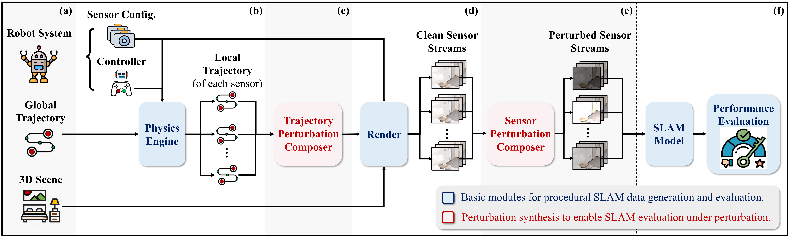

<!-- PROJECT LOGO -->

<p align="center">

  <h1 align="center">Customizable Perturbation Synthesis for Robust SLAM Benchmarking</h1>
  <p align="center">
    <a href="https://scholar.google.com/citations?user=3Ifn2DoAAAAJ&hl=en"><strong>Xiaohao Xu</strong></a>
    ·
    <a href="https://scholar.google.com/citations?user=n11gQKoAAAAJ&hl=en"><strong>Tianyi Zhang*</strong></a>
    ·
    <a href=""><strong>Sibo Wang*</strong></a>
    ·
    <a href="https://lxa9867.github.io/"><strong>Xiang Li</strong></a>
    ·
    <a href=""><strong>Yongqi Chen</strong></a>
    <br>
    <a href="https://ywyeli.github.io/"><strong>Ye Li</strong></a>
    ·
    <a href="http://mlsp.cs.cmu.edu/people/bhiksha/"><strong> Bhiksha Raj</strong></a>
        ·
    <a href="https://www.ri.cmu.edu/ri-faculty/matt-johnson-roberson/"><strong> Matthew Johnson-Roberson</strong></a>
        ·
    <a href="https://scholar.google.com/citations?hl=zh-CN&user=MNKU_WcAAAAJ&view_op=list_works"><strong>Xiaonan Huang</strong></a>
  </p>
    <p align="center">
    <strong>UMich Robotics</strong>
    ·
    <strong>CMU Robotics</strong>
    ·
    <strong>CMU ECE</strong>
  </p>
  <h3 align="center"><a href="https://arxiv.org/abs/2402.08125">Preprint Paper</a> | <a href="https://youtu.be/jNM94naSPXA">Video Demo</a></h3>
  <div align="center"></div>
</p>

<br>

## Code Coming Soon: Stay Tuned for Update!  :fire: :fire: :fire:

## Pipeline Overview
<p align="center">
  <a href="">
    
  </a>
</p>

- **Noisy data synthesis pipeline for SLAM evaluation under perturbation**.
- (**a**) Given the customizable robot system and global trajectory, (**b**) the local trajectory of each sensor can be generated via the physics engine. (**c**) Subsequently, the trajectory perturbation composer introduces deviations to simulate locomotion perturbations (**d**) Following this, the render combines sensor configurations, perturbed local trajectories, and 3D scene models to generate sensor streams. (**e**) Finally, the sensor perturbation composer introduces corruptions to the clean sensor streams, (**f**) resulting in perturbed data for SLAM robustness benchmarking

## Abstract
- **Robustness** is a crucial factor for the successful deployment of robots in unstructured environments, particularly in the domain of Simultaneous Localization and Mapping (SLAM).
- We **propose a novel, customizable pipeline for noisy data synthesis**, aimed at assessing the resilience of multi-modal SLAM models against various perturbations. 
- We introduce **comprehensive perturbation taxonomy** along with a perturbation composition toolbox, allowing the
transformation of clean simulations into challenging noisy environments.
- Utilizing the pipeline, we instantiate the **Robust-SLAM benchmark**, which includes diverse perturbation types, to evaluate the risk tolerance of existing advanced multi-modal SLAM models.
- Our extensive analysis **uncovers the susceptibilities of existing SLAM models** to real-world disturbance, despite their
demonstrated accuracy in standard benchmarks.

## Visualizations of SLAM under Perturbation
### :blush:  Successful Cases on ORB-SLAM3 Model
<p align="center">
  <a href="">
    
  </a>
</p>

### :sos: Failure Cases on ORB-SLAM3 Model
<p align="center">
  <a href="">
    
  </a>
</p>

### :blush: Successful Cases on SplaTAM-S Model
<p align="center">
  <a href="">
    
  </a>
</p>

### :sos: Failure Cases on SplaTAM-S Model
<p align="center">
  <a href="">
    
  </a>
</p>

## Future Directions
- **Perturbation**: Evaluate the SLAM model’s robustness under mixed perturbations and more diverse perturbation types.
- **Synthesis**: How to generate more realistic perturabtions and environments for more reliable SLAM simulation?
- **SLAM Model**: Extend the robustness evaluation to SLAM models with more diverse input modality types, e.g., LiDAR and sonar.
- **Robustness Enhancement**: Can you propose a more robust SLAM model that can survive more severe and diverse perturbations?
- **Beyond SLAM**: The evaluation can be easily extended to 3D reconstruction and other robotic navigation tasks.
- (Please refer to the paper for more details 😄)

## Citation

Please cite our paper if you find this repo useful! :yellow_heart: :blue_heart: :yellow_heart: :blue_heart:

```bibtex
@inproceedings{xu2024customizable,
  title={Customizable Perturbation Synthesis for Robust SLAM Benchmarking},
  author={Xu, Xiaohao and Zhang, Tianyi and Wang, Sibo and Li, Xiang and Chen, Yongqi and Li, Ye and Raj, Bhiksha and Johnson-Roberson, Matthew and Huang, Xiaonan},
  booktitle={ArXiv},
  year={2024}
}
```

## Contact
If you have any question about this project, please feel free to contact xiaohaox@umich.edu
